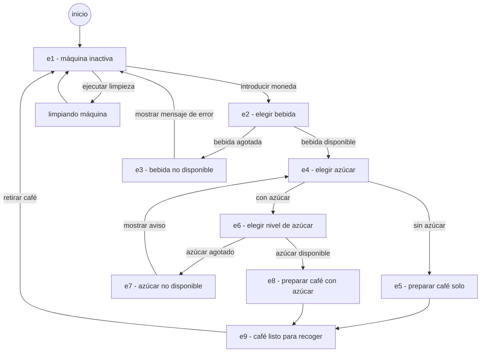

```mermaid
flowchart TD
    A((inicio)) --> B["e1 - máquina inactiva"]

    B -->|introducir moneda| C["e2 - elegir bebida"]

    C -->|bebida disponible| D["e4 - elegir azúcar"]
    C -->|bebida agotada| E["e3 - bebida no disponible"]

    E -->|mostrar mensaje de error| B

    D -->|sin azúcar| F["e5 - preparar café solo"]
    D -->|con azúcar| G["e6 - elegir nivel de azúcar"]

    G -->|azúcar agotado| H["e7 - azúcar no disponible"]
    H -->|mostrar aviso| D

    G -->|azúcar disponible| I["e8 - preparar café con azúcar"]

    F --> J["e9 - café listo para recoger"]
    I --> J

    J -->|retirar café| B

    B -->|ejecutar limpieza| K["limpiando máquina"]
    K --> B
```
